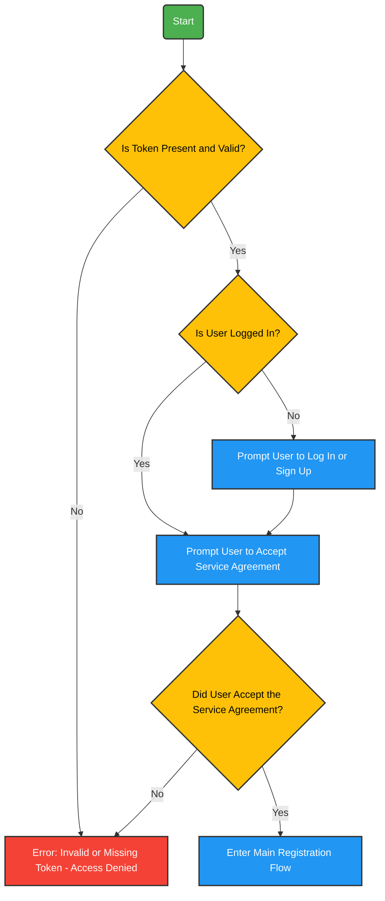

## **Token Verification & Initial Steps**  

### **QR Code & Token Validation**  
Before starting the registration process, users must **scan a QR code** containing a **unique token**.  

- **If the token is missing or invalid:**  
  - The system returns an **error message** and **blocks access**.  
- **If the token is valid:**  
  - The system proceeds to check the **user's login status**.  

---

### **Login & Service Agreement Handling**  

#### **If the user is logged in:**  
- They are **prompted** to accept the **service agreement** before continuing.  

#### **If the user is NOT logged in:**  
- They are required to **log in or sign up** first.  
- After successfully logging in or creating an account, they are **prompted to accept the service agreement**.  
