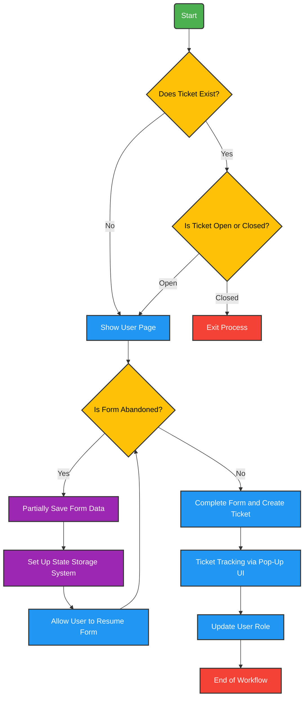

### **1. Ticket Verification**  
- **Initial Check:** Determine if a ticket already exists for the user.  
- **No Existing Ticket:** If no ticket is found, direct the user to the **User Page** to proceed.  
- **Existing Ticket:**  
  - **If Open:** Redirect the user to the **User Page** to continue.  
  - **If Closed:** Exit the process.  

---

### **2. Handling the User Page**  
- **Page Display:** Show the **User Page**, where users can either complete their registration or follow the necessary steps.  
- **Form Abandonment:**  
  - **Partial Save:** If the form is left incomplete, automatically save the entered data.  
  - **State Storage:** Ensure the system securely stores incomplete form data, allowing users to resume where they left off at any time.  

---

### **3. Ticket Processing**  
- **Form Completion:** Once all required information is entered, a **ticket is created** in the system.  
- **Ticket Tracking:** Provide a real-time pop-up UI to keep users updated on their ticket’s status.  
- **User Role Update:** Adjust the user’s role if necessary.  
- **End of Workflow:** The process concludes once the ticket is successfully processed.  
